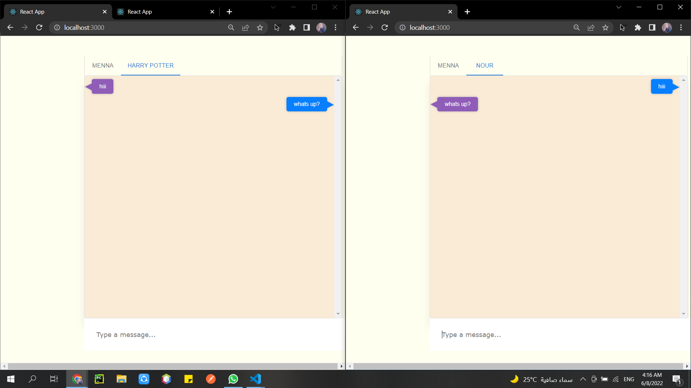

<h1 align="center">Chatting App MERN Project</h1>
<h3 align="center">ITI student, IoT departments intake 42 (2022)</h3>  
 

## OBJECTIVE
  This project aims to develop a Chatting App using MERN stack. It mainly consists of developing and implementing Front End App
  using React JavaScript library, Back End server using NodeJs, and to use socket.io to communicate between the client and server.  

  
<!-- #################################################### -->

<!-- #################################################### -->
<h1 align="center">Back End</h1>
  
  <h2><a href="https://github.com/mennahamdy33/chatting-app-backend">Githup link backend part</a></h2>
  

  
<!-- #################################################### -->

<!-- #################################################### -->
<h1 align="center">Front End</h1>
  <h2>Chatting App</h2>
  <h2><a href="[https://github.com/AhmedElKhouly99/Good-Reads-Users](https://github.com/mennahamdy33/chatting-app-frontend)">Githup link frontend part</a></h2>
  
  

      
  

  
